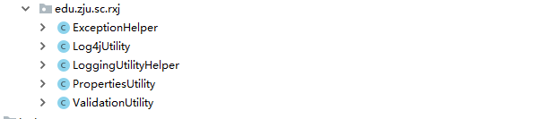
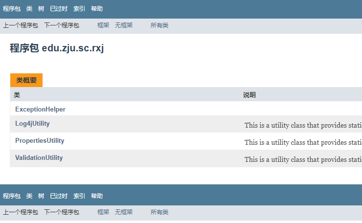
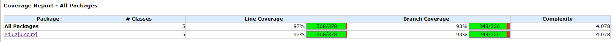
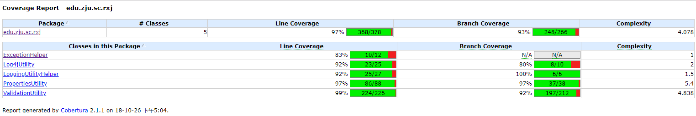
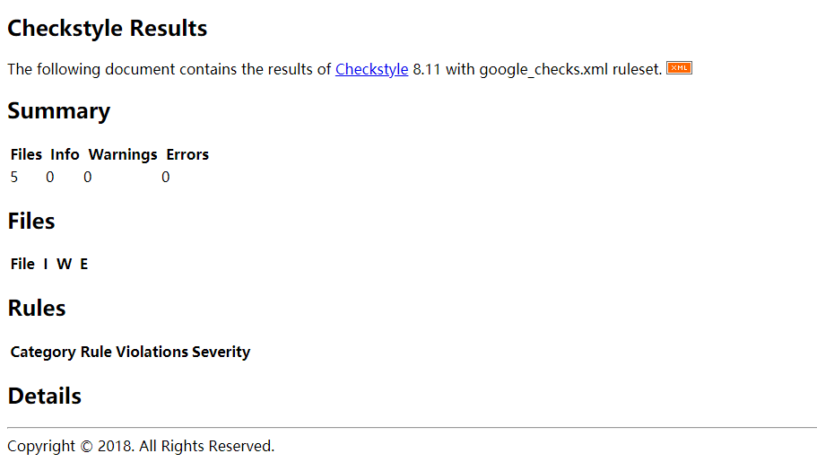

# aoot_hw4_topcoder_utils
#### 概述

20181026 AOOT第四次作业 topcoder_utils模块的开发与测试

实现了Utils工具类:

- 
- 构建工具:**maven**
- 集成开发工具:IDEA

#### 文档

**访问:	[JavaDoc](./target/site/edu/zju/sc/rxj/package-summary.html)**

#### **测试**

基于JUnit编写测试用例，总体代码测试覆盖率超过97%。使用`Cobertura`工具。

**访问: 	[cobertura测试报告](./target/site/cobertura/index.html)**

​		**[测试日志](./target/surefire-reports)**

#### 代码格式检查

源代码严格遵循`Google Checks`标准。使用Checkstyle进行代码检查。

**格式检查报告:**		**[Check Report](./target/site/checkstyle.html)**

